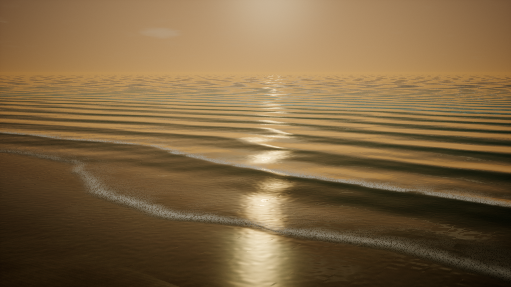

# Three.js to UE validation — 2026-10-03

The converter is in `tools/three_to_unreal`. The desktop remains Rust/wgpu.

## Actual source project

Read-only source: `C:/Users/grand/Documents/Playground/three-ocean-beach`.
Source dependency: Three.js 0.170.0. This project uses analytic waves, not a GPU fluid solver.
Its ShaderChunk dictionary is loaded from that project when compiling.

- Eight full shaders compile through glslang 16.6.0 and SPIRV-Cross: sky,
  terrain, water and instanced grass, each vertex and fragment.
- The focused native fixture contains sky, terrain and water GLB meshes,
  two generated 1024-square sand textures, three native Custom HLSL materials,
  terrain/water WPO and a UE scene-color/depth refraction adapter.
- UE5.8.2, real D3D RHI: all three materials have valid compiled shader maps
  and no material compilation errors. All three meshes have their native material
  assigned. A test level is saved. This checks actual UE HLSL compilation, not NullRHI.
- Evidence: `ELFENTIER_OCEAN_NATIVE_IMPORT_PASS`, local
  `artifacts/ue-smoke/ocean-result.json` with `hlsl_compilation_verified: true`.
- Actual 1024×576 SceneCapture2D output shows the sky, sand, wave displacement,
  refraction and foam. The test rejects black captures and checks native material
  assignments after reloading assets. Evidence: `ELFENTIER_OCEAN_RENDER_PASS`,
  local `artifacts/ocean-render/ocean-native.png` and the saved OceanTest map.
  UE5.8 headless reload required `refresh_native_materials()` before capture;
  a valid shader map alone did not produce a valid initial render. The helper
  recompiles loaded Editor material resources and rejects compilation errors.
- Grass, stones, cape, GUI, audio and camera following are excluded from the
  focused native fixture. Grass shaders are covered by language compilation.
  Pixel equivalence with the WebGL scene is not asserted.

## Native GPU fluid execution

`examples/stable-fluid.mjs` defines the entire five-pass test solver: velocity
advection, divergence, Jacobi pressure, pressure projection and dye transport.
The emitted Runtime plugin is built using the installed UE5.8.2 toolchain.
Its GPU work runs as GlobalShaders in an RDG graph and outputs native RGBA32f
UTextureRenderTarget2D resources. Every pass samples the previous epoch; states
swap only after all five passes. Each Step iteration matches one
GPUComputationRenderer.compute() call.

`test/ue_gpu.py` executed six epochs of an 8×4 grid. All 640 RGBA components
across five variables were read back from actual GPU textures and compared
against the separate integer-cell CPU reference. Maximum absolute error:
**1.1920928955078125e-7** (tolerance 2e-5).

Evidence: `ELFENTIER_NATIVE_GPU_EXECUTION_PASS` and local
`artifacts/ue-smoke/gpu-result.json` with `ok: true`, `samples: 640`.

This validates whole captured graph execution. It does not infer arbitrary
JavaScript orchestration or translate unknown external textures/SSBOs. A solver
whose JS repeats only the pressure pass needs an explicit scheduling adapter.
The current generated runtime repeats the complete graph per iteration.

## Automated checks

- Node: 22 tests, including real GLSL compilers, full graph generation,
  initial state serialization, feedback scheduling and resource validation.
- Python: 8 bundle preflight tests, including compiled material texture/WPO paths.
- Base asset pipeline: Rust core 72 tests and VDB converter 3 tests passed before
  the GPU extension; no Rust code changed in the extension.
- Base fixture: Blender 4.4 Alembic roundtrip positions and UE5.8.2 actual GLB,
  GeometryCache and static SVT import/assignment passed.
- `git diff --check` passed. CI installs glslang-tools/SPIRV-Cross and enables
  the real compiler tests. CI completion is separate from this local evidence.

The generator's own `native-port-report.json` initially marks build/execution
unverified. That is intentional: generating code does not prove a new user's
shader/solver compiles or runs correctly on their target UE/platform.
